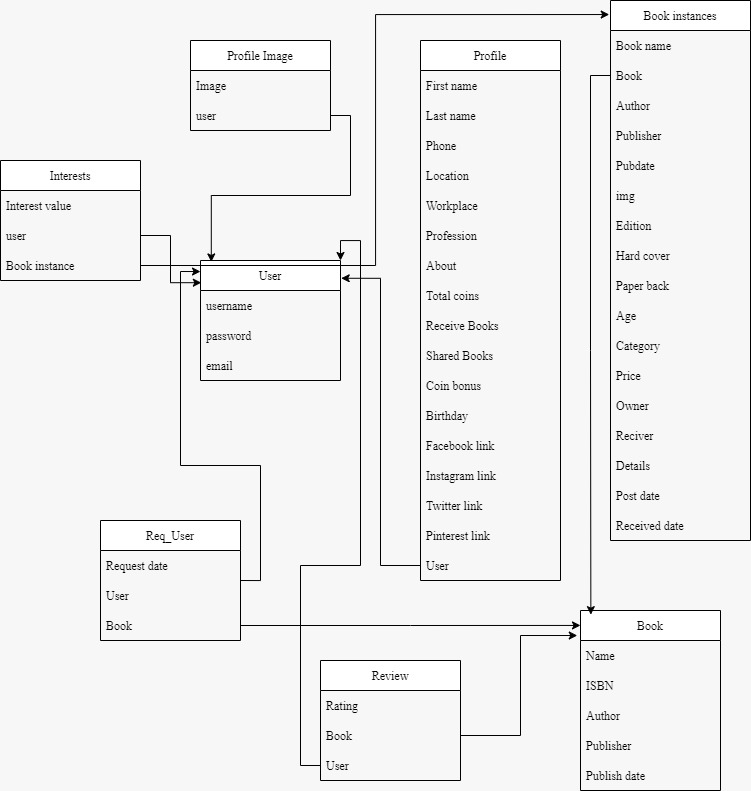
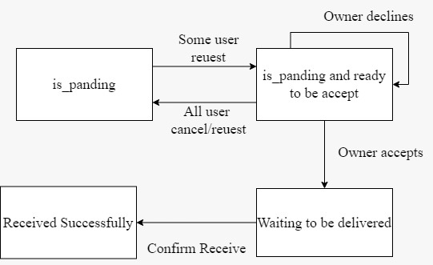

  

 <h1 align="center">Boi Bondhu</h2>
 
“Boi-Bondhu”. A platform to share and recieve old bookswithin your community!

## Team Members:
* Ashfaqur Rahman Adib- 1804055
* Tahlil Abrar- 1804056
* Zerin Shaima Meem- 1804057
## Contents:
- [Required Technologies](#Required-Technologies)
- [User interface](#User-Interface)
  - [Home Page](#Home-Page)
  - [How to Swap](#How-to-swap)
  - [Browse](#Browse)
  - [Blogs](#Blogs)
  - [About Us](#About-Us)
  - [Pricing Plan](#Pricing-Plan)
  - [Profile](#Profile)
  - [My Books](#My-Books)
## Required Technologies
* HTML
* CSS
* SASS
* JavaScript
* JQuery
* Swiper JS
* Bootstrap
* Django Python with SQLite

## Data Base Design
We used a relational database SQLite for the backend of our web application. The database 
design of the website took 8 entities with their appropriate attributes. The following is the 
diagram of our web application:

## Book State Diagram
When a user add books as posts it has many stages which we describe in Fig 2.2 as states. This 
state diagram helps us to design books/user interaction. Those states are given here in the 
following state diagram: 

## User interface
- [Home Page](#Home-Page)
- [How to Swap](#How-to-swap)
- [Browse](#Browse)
- [Blogs](#Blogs)
- [About Us](#About-Us)
- [Pricing Plan](#Pricing-Plan)
- [Profile](#Profile)
- [My Books](#My-Books)

## Features
- [Sign-up](#sign-up)
- [Log-in](#Log-in)
- [Notification alert](#Notification-alert)
- [Button Disable](#Button-Disable)
- [Coupons](#Coupons)
- [Coin Shortage](#Coin-Shortage)
