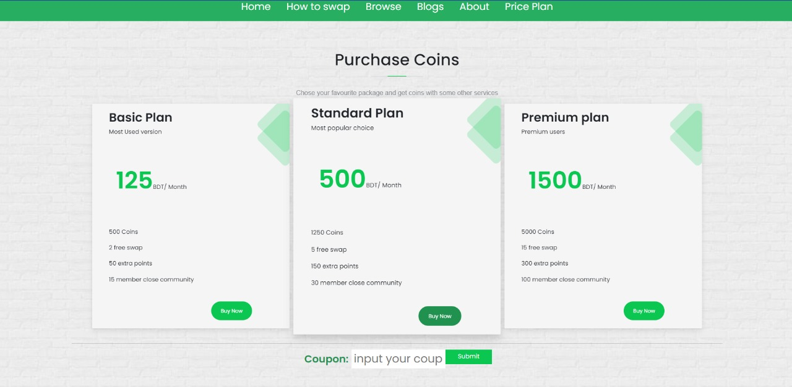

  

 <h1 align="center">Boi Bondhu</h2>
 
“Boi-Bondhu”. A platform to share and recieve old bookswithin your community!

## Team Members:

- Ashfaqur Rahman Adib- 1804055
- Tahlil Abrar- 1804056
- Zerin Shaima Meem- 1804057

## Contents:

- [Required Technologies](#Required-Technologies)
- [Data Base Sesign](#Data-Base-Design)
- [Book State Diagram](#Book-State-Diagram)
- [User interface](#User-Interface)
  - [Home Page](#Home-Page)
  - [How to Swap](#How-to-swap)
  - [Browse](#Browse)
  - [Blogs](#Blogs)
  - [About Us](#About-Us)
  - [Pricing Plan](#Pricing-Plan)
  - [Profile](#Profile)
  - [My Books](#My-Books)
- [Features](#Features)
  - [Sign-up](#sign-up)
  - [Log-in](#Log-in)
  - [Notification alert](#Notification-alert)
  - [Button Disable](#Button-Disable)
  - [Coupons](#Coupons)
  - [Coin Shortage](#Coin-Shortage)

## Required Technologies

- HTML
- CSS
- SASS
- JavaScript
- JQuery
- Swiper JS
- Bootstrap
- Django Python with SQLite

## Data Base Design

We used a relational database SQLite for the backend of our web application. The database
design of the website took 8 entities with their appropriate attributes. The following is the
diagram of our web application:

## Book State Diagram
When a user add books as posts it has many stages which we describe in Fig 2.2 as states. This state diagram helps us to design books/user interaction. Those states are given here in the following state diagram:

## User interface
### Home Page
Before signup, this page will give a brief introduction about the application. When a user signs up for the first time he would be given 500 coins as a sign-up bonus.
#### Before Sign-Up

After Sign-Up, it will give a welcome message.
#### After Sign-Up

### How to Swap

This page gives the brief idea of using the web application step by step. The page is divided
into 4 sections describing 4 steps of understanding to use the web application.

### Browse

This page is visible after the user creates an account. He can scroll through all available
books from the browsing page and send requests for any of them.

#### Read More

This is a subpage of every book card. Here user can find all information about a book, its
provider or receiver. Here user can give a rating to that book.

### Blogs

This page comes with some handpicked blogs from different writers. Those blogs are selected by our editors. Those blogs are given with the intention to inspire our users into book reading.

### About Us

This is a page where users can learn about our goals and us, the creators of this application.

### Pricing Plan

This page shows our pricing plans and one can submit coupons here, to buy coins. Users can
enter coupons to redeem coins which are given in many special offers.

### Profile

In this page all the information about the user is shown. Also, users can see how many coins
they got, the number of books received and the number of books shared. On the lower right
corner there is a button for adding books for sharing.

### Add Books

A form to upload books into the database.

### My Books

This page holds 7 child pages. Each of those pages are given for users to keep track of their
activity with other users and different books.

#### Books Received

Shows list of books that the user received successfully already.

#### Books Giveaway
Shows list of books that the user has shared till date.

#### My Request
Shows list of books that user have sent request for, but still isn’t accepted.

#### New Request
Shows list of books that users have received requests for, but haven’t accepted or declined yet. Users can also see who has requested that book.

#### Pending
Shows list of books that users have sent requests for and is accepted, but yet not received by
the user that requested.

#### Waiting
Shows list of books that users have been waiting for. A confirmation button is given for making sure they received the book.

#### My Posts
Shows list of books that have been posted. Users can delete them if they want to.

## Features
### Sign-Up
#### Empty Form
A new user can not submit an empty form. Every filed in the form has to be filled up. Otherwise this following pop up message will be shown.

#### Existing Username

When a user inputs a username that is already in the database for other profile there will be an alert message. So, every username must be unique.

#### Incorrect Password
When the password fields do not match with each other there would be shown an error message in the homepage.

#### Password Too Short
If the password match and then the password length is less than 8 characters this error message would be shown.

### Log-In
If an existing user incorrectly enter his username or password this verdict will be shown.

### SEARCH RESULT
#### Keyword Searching
A user can search for different types of books by entering keywords in the search bar. The books with that keyword in their title will be shown.

#### No Result found
If a user enters a keyword that doesn’t match with any of the books in database than their will be shown “No Result Found”.

### Notification Alert
For a book request from other users a notification will be shown in top of the page.

### Button Disable
When a user tries to request any books from browsing page without logged in, they can’t do it. The buttons will be disable for them. Similar thing happened when an owner also tries to request his own book.

### Cupons
#### Coin Addition
When a user input correct coupon then the user will get his confirmation message. An automatically coin will be added in their vault.

#### Incorrect Coupon
When a user adds incorrect coupon in the coupon bar then an error message indicate that the coupon is not currently available.

### Coin Shortage
When a user tries to request a book whose coin price is greater than his currently held coins than the request wouldn’t be performed and the following verdict will be shown.

